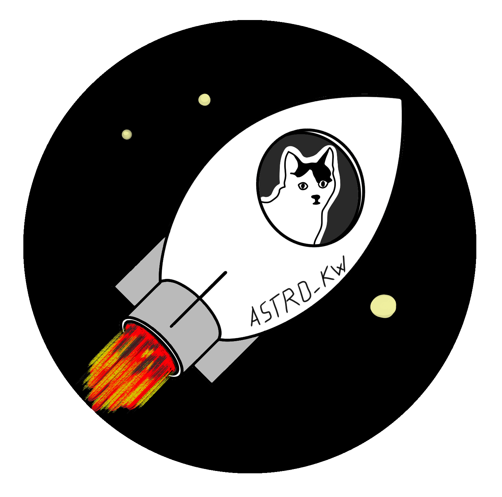
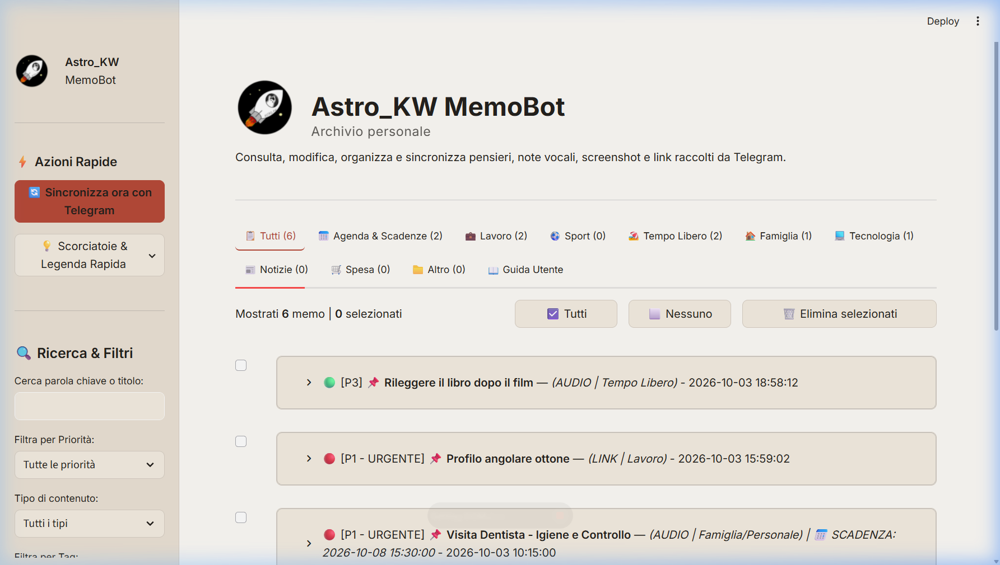
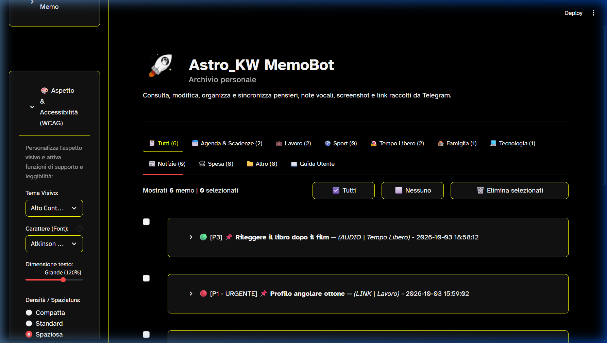
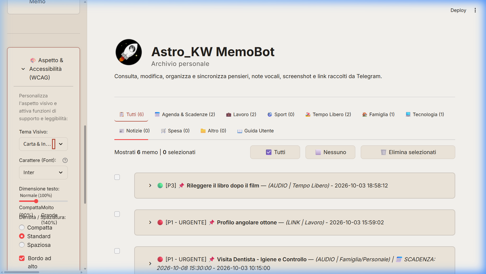
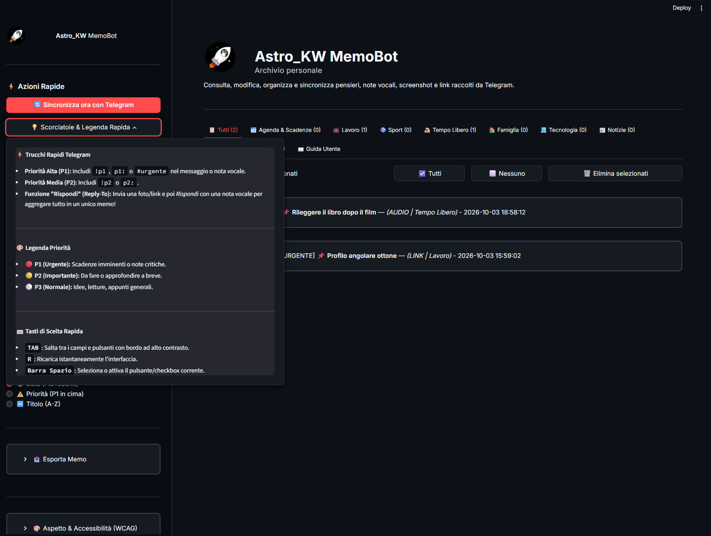
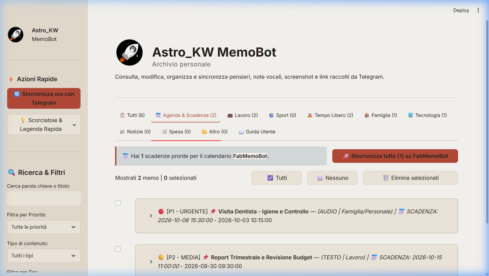

# 🧠 Astro_KW MemoBot

<p align="center">
  
</p>

<p align="center">
  <strong>Il Secondo Cervello Personale, Locale e Privacy-First.</strong><br>
  Cattura note vocali, link, foto e pensieri su Telegram, ordinali con modelli AI locali (Ollama Qwen 14B & Whisper) e sincronizza le scadenze con Google Calendar in totale riservatezza.<br>
  <em>Progettato come tecnologia assistiva ad alta accessibilità (WCAG AAA).</em>
</p>

<p align="center">
  
  
  
  
  
  
  
  
</p>

<p align="center">
  
</p>

---

## 🌟 La Visione del Progetto

Viviamo sommersi da idee, scadenze, link di articoli, vocali veloci e foto scattate al volo. La maggior parte delle app per appunti richiede tempo per essere aperta, catalogata e compilata, finendo per interrompere quello che stiamo facendo.

**Astro_KW MemoBot** ribalta questo paradigma:
1. **Durante il giorno (su smartphone):** Invia qualsiasi appunto alla tua chat privata di Telegram (un vocale registrato mentre cammini, un link di Instagram/YouTube, una foto di uno scontrino o un promemoria di testo).
2. **La sera (o quando accendi il PC):** Apri la dashboard locale e premi **"Sincronizza ora"**.
3. **Elaborazione 100% Locale:** Il tuo computer trascrive i vocali con **Whisper**, analizza immagini e testi con **Qwen 2.5**, assegna categorie e priorità (P1/P2/P3), estrae scadenze temporali e ti permette di inviarle a **Google Calendar con 1 solo clic**.

> [!IMPORTANT]
> **Zero Cloud, Privacy Assoluta:** Nessun dato, voce, immagine o nota personale viene mai inviato a server cloud di terze parti (OpenAI, Google, ecc.) per l'analisi AI. Tutto viene elaborato e custodito esclusivamente sulla tua macchina.

---

## ♿ Tecnologia Assistiva & Accessibilità (WCAG AAA)

Astro_KW MemoBot nasce con una forte vocazione per l'**accessibilità digitale**, rendendo la tecnologia fruibile anche a persone con disabilità visiva (ipovisione), dislessia o difficoltà motorie:

* **Tema Alto Contrasto (WCAG AAA):** Sfondo nero puro (`#000000`), testo bianco e accenti giallo sole con rapporto di contrasto reale superiore a **19:1** (lo standard WCAG AAA richiede 7:1).
* **Tipografia Inclusiva Integrata:**
  * **Atkinson Hyperlegible:** Carattere sviluppato dal *Braille Institute of America*, disegnato appositamente per differenziare chiaramente caratteri speculari o ambigui (`1`, `l`, `I`, `0`, `O`) per persone ipovedenti o dislessiche.
  * **Lexend:** Tipografia ottimizzata scientificamente per ridurre l'affaticamento visivo e massimizzare la fluidità di lettura.
* **Navigazione da Tastiera per Ausili Motori:** Pieno supporto al tasto `TAB` con anello di focus ad alto contrasto per navigare tra controlli e memo senza bisogno del mouse.
* **Scalatura Testo e Densità:** Ridimensionamento fluido dei font fino al **140%** e spaziatura regolabile per facilitare il tocco e il puntamento.

<p align="center">
  
  <br>
  <em>Vista ad Alto Contrasto (WCAG AAA - Ipovisione) con carattere Atkinson Hyperlegible.</em>
</p>

<p align="center">
  
  <br>
  <em>Tema Carta & Inchiostro (Sepia / Chiaro) con testo scuro riposante per lettura diurna.</em>
</p>

---

## 🛠️ Architettura di Sistema

```
 [ Smartphone (Telegram) ]
            │
            ▼  (Audio vocali, Link YouTube/Reels, Foto/Screenshot, Testo)
 [ Bot Telegram Privato ]
            │
            ▼  (Sincronizzazione Batch su comando utente)
┌────────────────────────────────────────────────────────┐
│                   Astro_KW MemoBot                     │
│                                                        │
│  1. Trascrizione Audio  ➔ Whisper + ffmpeg (Locale)   │
│  2. Visione & OCR       ➔ Qwen 2.5-VL 7B (Ollama)      │
│  3. Web Scraping        ➔ oEmbed / OpenGraph Parser    │
│  4. Ragionamento & AI   ➔ Qwen 2.5 14B (Ollama Locale) │
│     └─ Priorità P1/P2/P3, Categorie, Calendario date   │
│  5. Database Sicuro     ➔ SQLite Locale (`memobot.db`) │
└────────────────────────────────────────────────────────┘
            │
      ┌─────┴────────────────────────┐
      ▼                              ▼
[ Dashboard Web (Streamlit) ]   [ Google Calendar (OAuth 2.0) ]
- Filtri, Ricerca full-text     - Sync scadenze in 1-Click
- Temi WCAG AAA & Color Picker  - Calendario isolato `MemoBot`
- Cancellazione di gruppo       - Sincronizzazione cumulativa
- Condivisione WhatsApp/Telegram
```

---

## ✨ Caratteristiche Principali

* 🎙️ **Comprensione Naturale della Voce:** Parla liberamente in italiano. MemoBot inietta dinamicamente un calendario a 7 giorni nel prompt, comprendendo con precisione espressioni come *"giovedì prossimo alle 15"*, *"domani sera"* o *"il 25 del mese"*.
* 📸 **Visione & OCR Documentale:** Scatta una foto a una ricevuta, fattura, volantino o schermata: l'AI estrae testo, cifre, date e crea un riassunto strutturato.
* 🔗 **Web Scraping Integrato:** Condividi link di YouTube, Instagram Reels o articoli web: MemoBot ne estrae titolo, descrizione e contenuto prima di elaborarli.
* 💬 **Aggregazione Intelligente "Rispondi" (Reply-To):** Invia una foto o un link e rispondi con una nota vocale: MemoBot fonderà i due messaggi in un unico memo coerente!
* ⚡ **Scorciatoie Rapide su Telegram & Legenda:** Scrivi o detta `!p1`, `p1:` o `#urgente` per contrassegnare immediatamente una nota come urgente e prioritaria. Puoi consultare la legenda rapida in qualunque momento dal pannello laterale.

<p align="center">
  
  <br>
  <em>Popover laterale con scorciatoie Telegram, legenda priorità e navigazione da tastiera.</em>
</p>

* 📅 **Google Calendar Dedicato:** Crea gli eventi direttamente nel calendario dedicato (es. `MemoBot` o `FabMemoBot`) con un clic o in modalità cumulativa, distinguendo eventi a orario prefissato ed eventi "Tutto il giorno".

<p align="center">
  
  <br>
  <em>Scheda Agenda & Scadenze con sincronizzazione 1-Click su Google Calendar.</em>
</p>

* 🗑️ **Cancellazione Massiva Sicura (Bulk Delete):** Toolbar galleggiante con pulsanti "Tutti/Nessuno", contatore dinamico e conferma prima dell'eliminazione.
* 📲 **Condivisione Rapida:** Box formattato con Titolo, Riassunto e Fonte con pulsanti di inoltro diretto su WhatsApp e Telegram.

---

## 🚀 Guida Rapida all'Installazione (Quick Start)

### 1. Prerequisiti
* **Python 3.10 o superiore**
* **[Ollama](https://ollama.com/)** installato sul proprio computer.
* **[ffmpeg](https://ffmpeg.org/)** (necessario per la conversione degli audio vocali Telegram).
  * *Windows:* Installabile con `winget install Gyan.FFmpeg` oppure `choco install ffmpeg`.
  * *Linux/macOS:* `sudo apt install ffmpeg` o `brew install ffmpeg`.

### 2. Modelli AI Locali (Flessibilità & Requisiti Hardware)

Astro_KW MemoBot è completamente modulare e legge i nomi dei modelli direttamente dal file `.env`. Puoi scegliere la combinazione più adatta all'hardware a tua disposizione:

#### 🟢 Configurazione Consigliata (Qualità Ottimale, ~12-16 GB RAM/VRAM)
La combinazione ideale per la massima fedeltà nel ragionamento logico, calcolo delle date e comprensione visiva:
```bash
# Modello principale per ragionamento, riassunti, priorità e date
ollama pull qwen2.5:14b

# Modello per visione e OCR di scontrini, fatture e screenshot
ollama pull qwen2.5vl:7b
```

#### 🟡 Configurazione Leggera (Per Portatili o PC con 6-8 GB RAM/VRAM)
Se disponi di risorse hardware più contenute, puoi adottare modelli compatti e veloci:
```bash
# Modelli di testo leggeri ed efficienti (scegline uno)
ollama pull qwen2.5:7b       # oppure: ollama pull llama3.1:8b  /  ollama pull mistral:7b

# Modelli di visione leggeri
ollama pull minicpm-v        # oppure: ollama pull llava
```

> [!TIP]
> Per passare da un modello all'altro basta modificare le righe `OLLAMA_MODEL` e `OLLAMA_VISION_MODEL` all'interno del file `.env`! Nessun'altra modifica al codice è necessaria.


### 3. Installazione del Repository
```bash
# Clona il repository
git clone https://github.com/TuoUsername/Astro_KW_MemoBot.git
cd Astro_KW_MemoBot

# Crea e attiva un ambiente virtuale (consigliato)
python -m venv venv
# Su Windows:
venv\Scripts\activate
# Su Linux/macOS:
source venv/bin/activate

# Installa le dipendenze
pip install -r requirements.txt
```

### 4. Configurazione del file `.env`
Copia il file di esempio e configuralo con le tue chiavi:
```bash
cp .env.example .env
```
Apri il file `.env` con un editor di testo e compila:
* `TELEGRAM_BOT_TOKEN`: Il token del tuo bot privato ottenuto da [@BotFather](https://t.me/BotFather) su Telegram.
* `ALLOWED_TELEGRAM_USER_IDS`: Il tuo ID numerico Telegram (se lasciato vuoto, al primo messaggio MemoBot mostrerà a video il tuo ID per inserirlo).
* `GOOGLE_CALENDAR_NAME`: Nome del calendario Google dedicato (predefinito: `MemoBot`).

### 5. Avvio dell'Applicazione
```bash
streamlit run app.py
```
Oppure su Windows, fai doppio clic sul file batch:
👉 **`Avvia_MemoBot.bat`**

La dashboard si aprirà automaticamente nel browser all'indirizzo `http://localhost:8501`.

---

## 📅 Configurazione Google Calendar (Opzionale ma Consigliata)

Per abilitare la sincronizzazione a 1-clic con Google Calendar:
1. Accedi a [Google Cloud Console](https://console.cloud.google.com/) e crea un nuovo progetto.
2. Abilita la **Google Calendar API**.
3. Nella sezione **Schermata consenso OAuth**, scegli *Utente esterno*, inserisci il tuo indirizzo email e aggiungi te stesso come *Utente di test*.
4. Nella sezione **Credenziali**, crea un'identità **ID client OAuth** (Tipo di applicazione: *Applicazione desktop*).
5. Scarica il file JSON generato, rinominalo esattamente in **`credentials.json`** e posizionalo nella cartella principale di MemoBot.
6. Esegui una volta sola il comando:
   ```bash
   python setup_google_calendar.py
   ```
   Si aprirà una schermata del browser in cui confermare l'autorizzazione. Verrà generato automaticamente il file `token.json` permanente. Da quel momento, potrai sincronizzare qualsiasi scadenza con 1 clic direttamente dalla dashboard!

---

## 🗺️ Roadmap dei Prossimi Sviluppi

- [x] **v1.0 (Attuale):**
  - Trascrizione Whisper locale e Visione OCR per immagini.
  - Normalizzazione fuso orario e iniezione calendario a 7 giorni per date esatte.
  - Sincronizzazione ufficiale Google Calendar API in 1-Click o cumulativa.
  - Dashboard interattiva con selezione multipla e Bulk Delete.
  - Motore di personalizzazione grafica e accessibilità WCAG AAA (temi scuro, carta chiara, alto contrasto ipovisione, font Atkinson Hyperlegible e Lexend).
  - Guida utente completa integrata nativamente nell'interfaccia.
- [ ] **v1.1 (Prossima Milestone):**
  - **Local RAG Chat con Ollama ("Chiedi al Tuo Secondo Cervello"):** Nuova scheda dedicata in dashboard per dialogare in linguaggio naturale con l'intero archivio storico dei memo e ricevere sintesi ragionate in locale con `qwen2.5:14b`.
- [ ] **v1.2:**
  - Supporto per internazionalizzazione multilingua (i18n).

---

## 🌍 Community & Traduzioni (Translations Welcome!)

Astro_KW MemoBot è attualmente configurato con prompt e interfaccia in lingua italiana.  
Poiché i modelli sottostanti (Whisper e Qwen) sono nativamente multilingue, accogliamo con entusiasmo contributi per aggiungere:
* Traduzioni dell'interfaccia in inglese, spagnolo, francese, tedesco, ecc.
* Ottimizzazione dei prompt locali per lingue diverse.

Se desideri contribuire, consulta il file `CONTRIBUTING.md` e apri una *Pull Request*!

---

## 📜 Licenza d'Uso (GNU GPLv3 - Copyleft Forte)

Questo progetto è rilasciato sotto la licenza **GNU General Public License v3 (GPLv3)**.

Ciò significa che:
* ✅ Sei libero di scaricare, utilizzare e studiare questo software gratuitamente.
* ✅ Sei libero di modificare il software e adattarlo alle tue esigenze.
* 🛡️ **Obbligo di Reciprocità (Copyleft):** Se modifichi questo software e lo distribuisci o pubblichi, **sei legalmente obbligato a rilasciare tutto il codice sorgente modificato sotto la stessa identica licenza aperta (GPLv3)**, gratuitamente e pubblicamente.
* 🚫 Nessuno può prendere questo codice, renderlo closed-source o rivenderlo privatamente.

Consulta il file [LICENSE](LICENSE) per i termini legali completi.

---

<p align="center">
  Sviluppato con passione per la libertà digitale, la privacy personale e l'accessibilità inclusiva.<br>
  <strong>Astro_KW MemoBot</strong> — <em>Il tuo Secondo Cervello, al tuo comando.</em>
</p>
